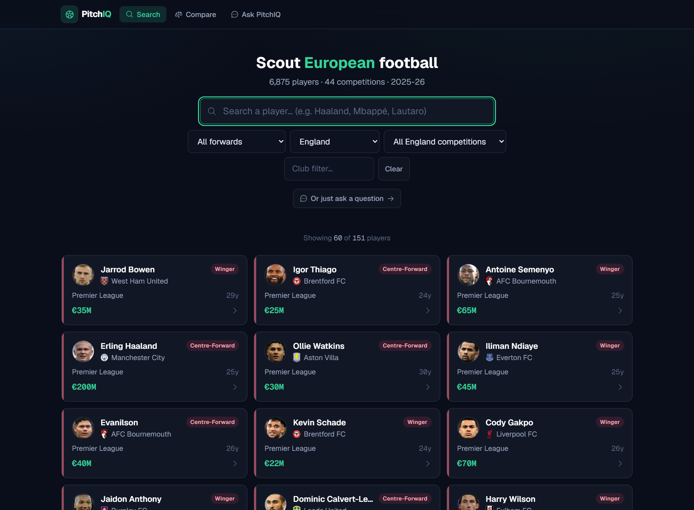
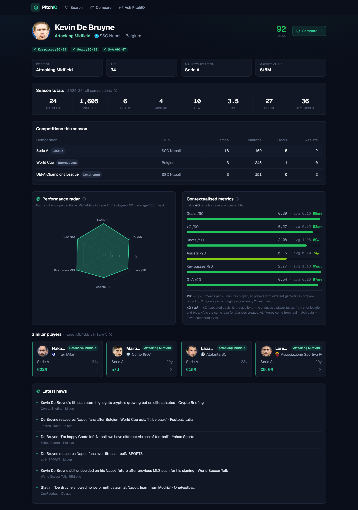
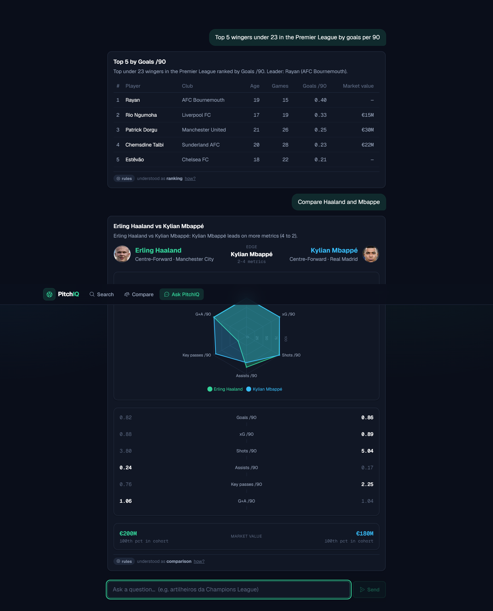
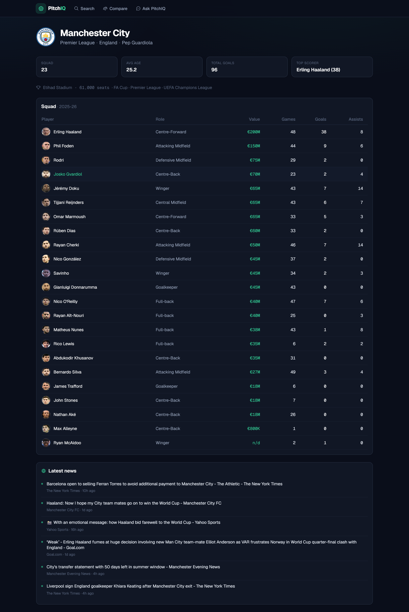
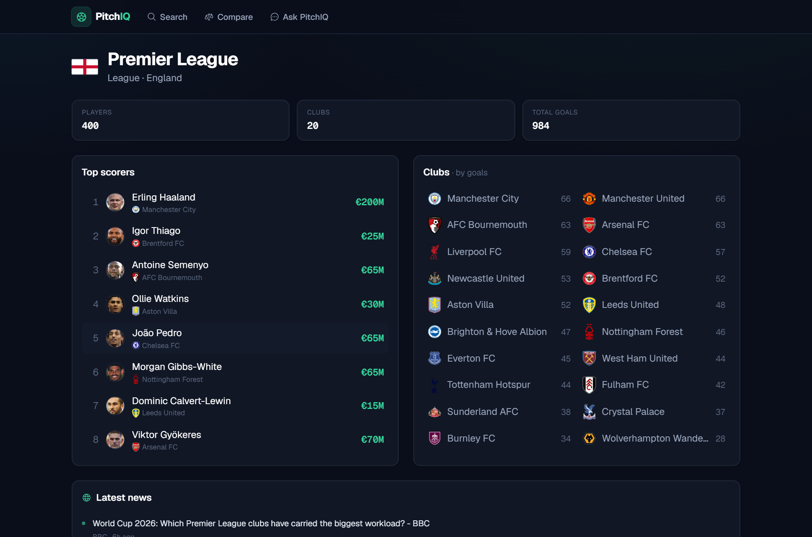

<div align="center">

# ⚽ PitchIQ

**Conversational football analytics for the 2025-26 European season.**
Search, profile, and compare players — or just ask in plain English.

`React + TypeScript` · `Python + FastAPI` · `Recharts` · `Gemini (swappable) + rule-based NLU` · `Docker`



</div>

---

## Why PitchIQ

Football data arrives as raw tables: no context, no narrative. A sporting director doesn't
think in spreadsheet columns — they think in questions. *"Who are the best young wingers in
Serie A?" "How does this striker compare to his peers?" "Is he worth the fee?"*

PitchIQ makes the same data reachable two ways: through **fast, purpose-built screens** and
through a **conversational layer** that turns a question into a chart, a table, or a visual
comparison. The numbers are always computed deterministically from the data — the language
model decides *what* to compute, never *what the answer is*.

---

## What it does

| Area | Highlights |
|------|-----------|
| **Search** | Real-time name search with filters by **position → role**, **country → competition**, and **club**. Every card shows the player's photo, club crest, competition, age, and market value. |
| **Player profile** | Photo, an overall **rating**, **strengths & weaknesses**, contextualised **percentile** metrics vs the player's position in their competition (radar + bars), season totals, a **per-competition breakdown**, **similar players**, and the latest **news**. Metrics are explained inline (what "/90" and percentiles mean). |
| **Team profile** | Club crest, stadium, coach, squad value/age, and the full **squad** with photos, values, and output. |
| **Competition profile** | Flag, top scorers, and every club ranked by goals — all clickable. |
| **Compare** | A real **visual** head-to-head: overlaid radar + per-metric diverging bars, so you see who's better at what in seconds. Market-value context included. |
| **Ask PitchIQ** | A chat that answers **rankings, lookups, and comparisons** in **English or Portuguese**, returning a chart / table / comparison / narrative — and failing gracefully on ambiguous or out-of-scope questions. |

### Screenshots

| Player profile | Ask PitchIQ (chat) |
|---|---|
|  |  |
| **Team profile** | **Competition profile** |
|  |  |

---

## Quick start

### Docker (one command)

```bash
cp .env.example .env        # optional: add a free GEMINI_API_KEY for LLM-powered chat
docker compose up           # builds and starts both services
```

- App → http://localhost:5173
- API + interactive docs → http://localhost:8000/docs

With **no key set**, the app is fully functional on the deterministic rule-based NLU (zero cost).
nginx serves the built frontend and proxies `/api` to the backend.

### Local (without Docker)

```bash
# backend
cd backend
pip install -r requirements.txt
uvicorn app.main:app --reload          # http://localhost:8000

# frontend (new terminal)
cd frontend
npm install
npm run dev                            # http://localhost:5173 (proxies /api -> :8000)
```

### Tests

```bash
cd backend && pytest                    # percentile/ranking math + query understanding
```

---

## How the conversational layer works

This is the heart of the app, and the design goal is simple: **let the model handle language,
and never let it touch the numbers.**

```
POST /chat
   │
   ▼  1. Query understanding  (app/nlu/)
   │     Gemini returns a StructuredQuery via a constrained JSON schema, OR the
   │     deterministic rule-based interpreter parses it. Either way the result is
   │     validated against closed vocabularies (metrics, competitions, roles…).
   ▼  2. Execution  (app/chat/executor.py)
   │     The StructuredQuery is dispatched to the SAME services the REST views use
   │     (search · ranking · stats · comparison). Every number originates here.
   ▼  3. Endpoint  (app/routes/chat.py)
         A thin, Pydantic-typed route returning a discriminated-union response.
```

**Why three layers?** Understanding, execution, and transport are different concerns with
different failure modes. Keeping them separate means the chat and the REST screens share one
source of truth for the maths, and the language model is confined to a single, auditable step.

A few deliberate choices:

- **Grounding.** Whatever the model returns is normalised against a closed vocabulary — `"EPL"`
  becomes *Premier League*, `"strikers"` becomes the *Centre-Forward* role, an aliased metric
  becomes its canonical key. Anything it can't resolve is dropped, so the model can't invent a
  metric or a competition.
- **Deterministic entity resolution.** The model only extracts the *raw name*; a fuzzy search
  service resolves it to a real player (typo-tolerant: `"halaand"` → Haaland; same-surname
  ties broken by prominence, so `"Mbappe"` → Kylian). Unknown names resolve to nothing, so the
  chat fails gracefully instead of guessing.
- **Explain trace.** Every answer carries the structured query that produced it, shown subtly
  in the UI — including whether the LLM or the rule-based engine resolved it.
- **Bilingual by default.** The rule-based interpreter has English *and* Portuguese triggers
  (accent-insensitive), so *"artilheiros da Champions League"* works with no API key. With a
  key, Gemini understands any language.
- **Correctness guarantee.** The model's output schema has **no numeric fields**. Percentiles,
  rankings, and comparisons are computed in the service layer, so a number in the chat is
  byte-for-byte the number on the screens. Covered by tests and auditable via the trace.

**Swappable & free.** Provider and key come from environment variables only (`LLM_PROVIDER`,
`GEMINI_API_KEY`). Adding a provider is one class plus one branch. The default is Gemini's free
tier (effectively $0 for normal use); with no key, the rule-based path handles everything.

---

## Data

**Season: 2025-26**, so squads are current (Haaland at Manchester City, De Bruyne at Napoli,
Mbappé at Real Madrid).

- **Primary source — [Transfermarkt player-scores](https://github.com/dcaribou/transfermarkt-datasets)**
  (CC0, no scraping). Per-appearance data is aggregated into **one row per (player,
  competition)** — the model that makes per-competition queries and the profile's
  competition breakdown possible. It also provides club metadata (crest, stadium, coach,
  squad value/age) and player photos.
- **Rich metrics — [Understat](https://understat.com)** (via `soccerdata`, plain HTTP). Big-5
  **league** rows are enriched with **xG, xA, shots, and key passes**, matched by name. This is
  a deliberate hybrid: broad coverage everywhere, richer analytics where they exist.

**Coverage:** ~12,300 rows · ~6,900 players · **44 competitions** — 14 top-division leagues,
their domestic cups, the UEFA Champions/Europa/Conference League, the World Cup, and AFCON.

**Honest trade-offs** (explained rather than hidden):

- Coverage is **Europe-centric**. The free, non-scraping sources don't carry player-level data
  for the Americas, Asia, Oceania, or African domestic leagues. FBref has them (with rich
  stats) but blocks scraping via Cloudflare, so they're out of scope here. The chat says so
  when you ask (*"top scorers in Brazil"* → a clear "not covered" message, not wrong data).
- **Event data (xG/shots) is Big-5 leagues only**, so radars for cups and smaller leagues are
  thinner and fall back automatically.
- **~19% of players have no market value** — these are lower-profile players Transfermarkt
  simply doesn't value, shown as "n/d" rather than a guess.

**Build pipeline.** `backend/scripts/build_dataset.py` (build-time only; needs `pandas` +
`soccerdata`) downloads, joins, and writes the CSVs. **The runtime never touches the network
or those libraries** — it reads the committed CSVs with the standard library, so the app boots
instantly and runs offline. To regenerate:

```bash
pip install -r backend/scripts/requirements-build.txt
python backend/scripts/build_dataset.py
```

---

## Architecture

### Backend — clean layers, one source of truth

```
backend/app/
  routes/         thin FastAPI endpoints (Pydantic models, meaningful error codes)
  services/       ALL football logic: search · stats · ranking · comparison · team · competition · news
  data/           repository.py — CSV access, abstracted (swap for a DB and nothing above changes)
  nlu/            query understanding: interpreter · llm_provider · rule_based · extractors
  chat/           executor.py — StructuredQuery -> ChatResponse, reusing the services above
  models/         domain + Pydantic response models (incl. the discriminated-union ChatResponse)
  metrics.py      the closed catalog of metrics a query can name
```

The chat and the REST views call the **same services**, so nothing is duplicated and the
numbers can't drift between them. Type hints are used throughout, not just in the models.

### Frontend — typed, componentised

```
frontend/src/
  pages/          Search · Profile · Team · Competition · Compare · Chat
  components/     Icon (Phosphor) · Avatar/Logo · Stat · PlayerCard · RadarChart
                  ComparisonView · InfoTip · NewsSection · renderers/ResponseRenderer
  api/client.ts   one typed client   ·   types.ts mirrors the backend   ·   lib/ format + colors
```

`ResponseRenderer` switches on the chat response's `type` and renders each shape (table, chart,
comparison, …) dynamically — adding a response type is a single new case.

### API surface

`GET /players/search` · `GET /players/{id}` · `GET /players/{id}/profile` · `GET /compare` ·
`POST /chat` · `GET /meta` · `GET /health` · `GET /teams/{id}` · `GET /teams/search` ·
`GET /competitions` · `GET /competitions/{name}` · `GET /news`

---

## Design decisions (and the reasoning)

- **One row per (player, competition)** — the only model that lets you ask "top scorers in the
  Champions League" *and* show a player's league/cup/continental split on their profile.
- **Committed CSVs, stdlib runtime** — no database and no runtime network dependency. Heavy
  build-time libraries stay out of the running app; it starts fast and works offline.
- **Rule-based NLU as a first-class citizen** — not a stub. It makes the product usable with no
  API key at zero cost, and it's where the LLM path lands whenever the model fails.
- **Discriminated-union chat responses** — the frontend renders any shape from one component;
  the backend guarantees the contract with Pydantic.
- **Deterministic maths, LLM for language** — the single most important line in the whole
  design, and the reason the app can be trusted.

---

## Metric glossary

- **/90** — per 90 minutes played; normalises for game time (0.8 goals/90 ≈ a goal every 112 min).
- **Percentile** — where a player ranks against others in the same position and competition
  (100 = best, 50 = average).
- **xG / xA** — expected goals / assists: the quality of chances taken / created (Big-5 leagues).
- **Rating** — the average percentile across a player's radar metrics.

---

## Roadmap

- Broader geographic coverage via a paid or licensed data source.
- Conversational memory (multi-turn follow-ups).
- Embeddings-based entity resolution and player similarity.
- A database behind the repository interface for larger datasets.

---

## Credits

Data from the [Transfermarkt datasets](https://github.com/dcaribou/transfermarkt-datasets)
(CC0) and [Understat](https://understat.com) via [`soccerdata`](https://github.com/probberechts/soccerdata).
Player photos and club crests from Transfermarkt; country flags from [flagcdn](https://flagcdn.com).
News via Google News. Icons by [Phosphor](https://phosphoricons.com/).
